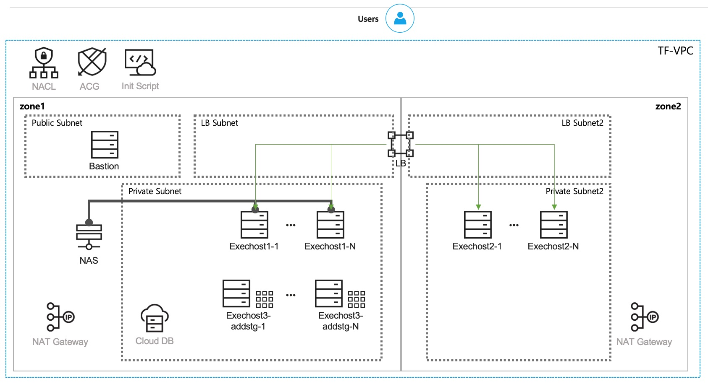

# Terraform Provisioning(for VPC)

해당 코드는 NCP VPC 인프라 프로비저닝 자동화를 위한 Terraform 코드입니다.

### 초기 구성도

### 준비사항

해당 문서 내에는 xx.env-var.sh로 표현하였으며, **리눅스 환경변수 설정**을 통해 입력값을 임시로 입력하였습니다.

- 추후 Jenkins를 이용한 인프라 프로비저닝 자동화 수행을 위해서 환경변수로 구성하였습니다.

> Linux OS 사용 방법으로 작성하였습니다.
> 
> - export TF_VAR_access_key="lGvL~~~"
> - export TF_VAR_secret_key="SHRK~~~"

### 사용방법

#### <생성 시>

 >1. xx.env-var.sh 내 코드들을 통해 환경변수를 선언합니다.
 >2. Terraform을 초기화합니다. 
      `terraform init`
 >3. Terraform plan을 통해 코드 수행이 정상적으로 가능한지 확인합니다.
      `terraform plan`
 >4. Terraform apply를 통해 정상 수행 가능한 코드를 수행합니다.
 -auto-approve 옵션을 이용하여 별도 확인없이 곧바로 수행 또한 가능합니다.
 `terraform apply (-auto-approve)`
 >5. 각 요소별로 템플릿화가 진행되어서 위 코드들을 한번에 수행할 수 있도록 make_tf.sh 파일을 통해 순서대로 생성되도록 제공할 예정입니다.

#### <반납 시>

 >1. xx.env-var.sh 내 코드들을 통해 환경변수를 선언합니다.
 >2. Terraform을 초기화합니다. 
      `terraform init`
 >3. Terraform plan을 통해 코드 수행이 정상적으로 가능한지 확인합니다.
      `terraform plan`
 >4. Terraform apply를 통해 정상 수행 가능한 코드를 수행합니다.
 -auto-approve 옵션을 이용하여 별도 확인없이 곧바로 수행 또한 가능합니다.
 `terraform destroy (-auto-approve)`
 >5. 각 요소별로 템플릿화가 진행되어서 위 코드들을 한번에 수행할 수 있도록 destroy_tf.sh 파일을 통해 순서대로 반납되도록 제공할 예정입니다.
 

### 코드 내 설정 내용
1. VPC 생성
2. NACL 생성
3. Subnet 생성(Public, Private, LB)
-- LB Subnet은 zone별로 1개씩 생성
-- Private Subnet은 원하는 수량 생성 가능(zone 선택 가능)
4. 서버 생성 전 ACG 구성
5. 서버 구성을 위한 init-script 구성(root password 변경)
6. Private Subnet에 사용 가능한 NAT Gateway 구성 및 route table 등록
-- NAT Gateway의 경우 zone 별로 1개씩 구성 가능하며, private route table에는 zone1의 NAT Gateway만 등록함. 
10. 서버 구성 - bastion(Public)
-- 해당 서버는 성능테스트 또는 기타 테스트 결과를 수집하여 메인 Logstash 서버로 전송합니다.
-- Login key 등록하여 사용합니다.
11. 서버 구성
-- 각 서버의 필요성에 따라 0~10개 이상으로 수량 생성 지정이 가능합니다.
-- 종류 - exechost1(Private, normal), exechost2(Private, 추가스토리지), exechost3(Private, 해당 zone NAS 생성 후 연결)
12. Load Balancer Target Group 구성 및 타겟 연결
-- LB 종류에 맞게 구성 필요(Application, Network, Network Proxy) 
13. Load Balancer 및 Listener 구성
-- 네트워크 타입에 따라(Public, Private) 멀티 zone/싱글 zone 구성 가능
14. CDB_MySQL 구성
-- API로 구성하게 되며, Terraform 환경변수를 통해 변수 입력 후 API 호출로 구성(아직 Terraform은 출시하지 않음.)

> Written with [StackEdit](https://stackedit.io/).